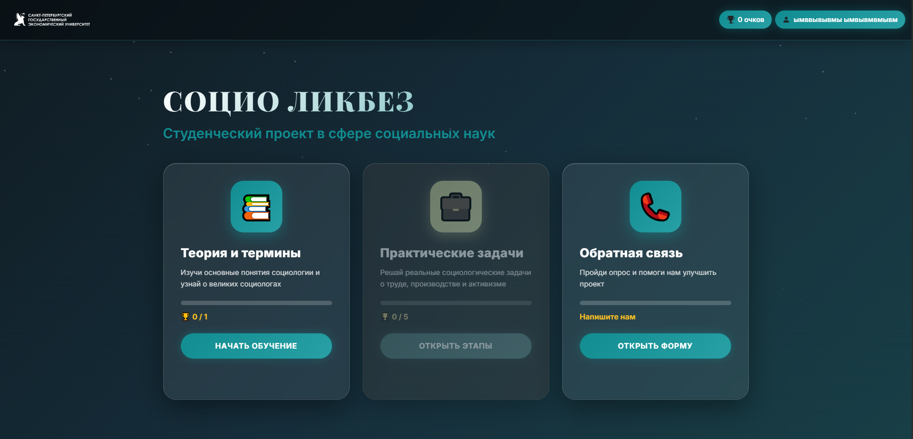
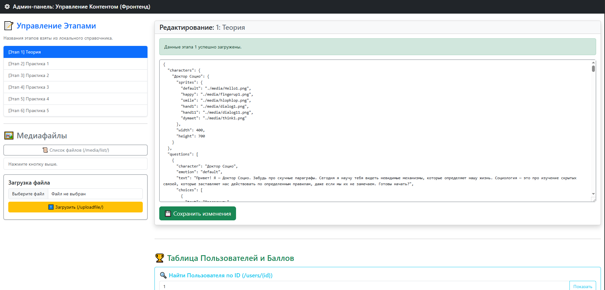
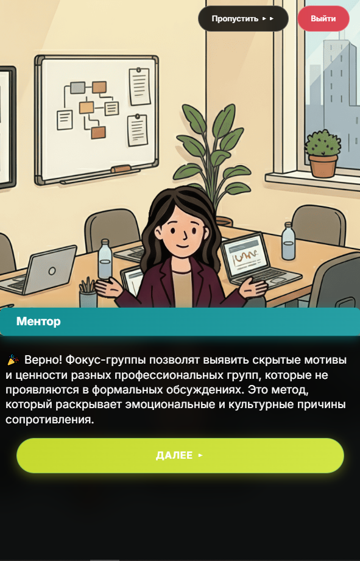
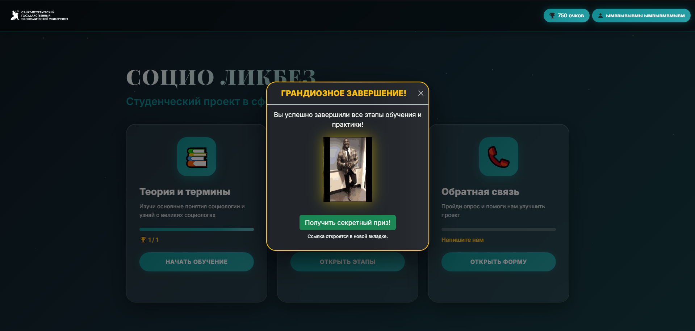

## Интерактивный тест в стиле визуальной новеллы

Проект был для СПБГэУ опрос для социологов, в проекте есть json конструктор диалогов с правильными ответами, панелями, позами персонажей и изменением фонов, все в example.txt и в админ панели 

- Версия python: 3.10.6

#### для старта используйте start.bat или venv
```
uvicorn main:app --reload --port 8080 --host 0.0.0.0
```
### Сервер запуститься на `localhost:8080`
- #### `localhost:8080/` главная страница
- #### `localhost:8080/admin.html` админка для изменения диалогов и загрузки изображений 

#### Json пример диалога в файле example.txt

## Иллюстрации проекта





